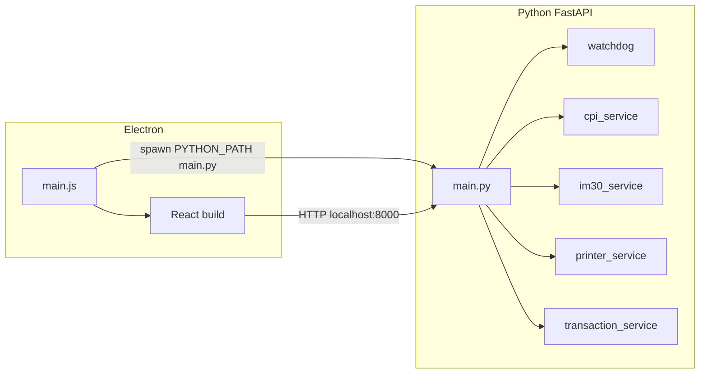

# Plan de implementación — Kiosco Cinemex

## Inconsistencia a tener en cuenta (PRD)

- En [PRD.md](c:\Users\rfigueroa\Jaguar de Mexico SA de CV\ING_Software - Documentos\JAGUAR_SHOWROOM\KIOSCO-CINEMEX\PRD.md) la **sección 16** dice que «el watchdog reinicia la app si cae», pero las **secciones 12–13** establecen que **solo el Task Scheduler de Windows** reinicia el proceso y que [`core/watchdog.py`](c:\Users\rfigueroa\Jaguar de Mexico SA de CV\ING_Software - Documentos\JAGUAR_SHOWROOM\KIOSCO-CINEMEX\PRD.md) **no reinicia** la app, solo actualiza `app_state["services"]`.
- **Implementación:** seguir secciones 12–13. **Criterio de éxito DoD «reinicio»:** verificar reinicio automático vía **Task Scheduler** (reiniciar si falla, delay 5 s), no vía Python.

---

## Arquitectura objetivo (resumen)

---

## Fase 1 — Estructura del proyecto y configuración base

**Objetivo:** Crear la **estructura de archivos exacta** del PRD (sección 5), dependencias Python y plantillas de configuración sin lógica de negocio compleja aún.

**Crear o modificar:**

| Área | Rutas |
|------|--------|
| Raíz `app/` | [`app/main.py`](app/main.py) (esqueleto mínimo que levanta FastAPI vacío o solo `/health`) |
| Core | [`app/core/state.py`](app/core/state.py), [`app/core/error_handler.py`](app/core/error_handler.py) (stub), [`app/core/watchdog.py`](app/core/watchdog.py) (stub) |
| Servicios | [`app/services/cpi_service.py`](app/services/cpi_service.py), [`im30_service.py`](app/services/im30_service.py), [`printer_service.py`](app/services/printer_service.py), [`mqtt_service.py`](app/services/mqtt_service.py) (stub con `publish_transaction`), [`transaction_service.py`](app/services/transaction_service.py) (stub) |
| Config | [`app/config/prod.yaml`](app/config/prod.yaml) (valores del PRD sección 6), [`app/config/catalog.json`](app/config/catalog.json) (array del PRD sección 7) |
| Python | [`app/pyproject.toml`](app/pyproject.toml) — FastAPI, Uvicorn, httpx (o requests) con soporte TLS, PyYAML, pydantic-settings, Pillow, pywin32, qrcode, python-dotenv |
| Entorno | [`.env.example`](.env.example) (plantilla PRD), [`.gitignore`](.gitignore) (`logs/`, `.env`, `node_modules`, `dist`, `build`, etc.) |
| UI | [`app/ui/`](app/ui/) — inicializar con **Vite + React + TypeScript** (no especificado en PRD; estándar con Electron), `package.json` con Blueprint v6 según [UI_GUIDELINES.md](c:\Users\rfigueroa\Jaguar de Mexico SA de CV\ING_Software - Documentos\JAGUAR_SHOWROOM\KIOSCO-CINEMEX\UI_GUIDELINES.md), `framer-motion`, fuentes (Source Sans Pro, Inter, Roboto vía CDN o `@fontsource`) |
| Assets | [`app/ui/src/assets/products/`](app/ui/src/assets/products/) — 9 PNG placeholder 800×800 con nombres del catálogo |
| Tema | [`app/ui/src/theme.css`](app/ui/src/theme.css) — variables CSS sección 3 de UI_GUIDELINES + `color-scheme: light only` y deshabilitar dark Blueprint |
| Electron | [`app/ui/electron/main.js`](app/ui/electron/main.js) (stub: ventana básica) |

**Criterio de éxito medible:**

- `tree`/listado coincide con PRD sección 5 (salvo archivos generados por Vite como `index.html`, `vite.config.ts`, que viven bajo `ui/`).
- `uvicorn` / `python main.py` responde `GET /health` con 200.
- `npm run dev` (UI) compila sin errores y muestra una pantalla vacía con Blueprint + `theme.css` cargado.

---

## Fase 2 — Logging, estado global, configuración en runtime y catálogo API

**Objetivo:** Cumplir secciones 3.3, 6 y 14 del PRD: logs diarios, `app_state`, carga de `prod.yaml` + variables de entorno, y exposición de catálogo.

**Crear o modificar:**

- Utilidad de logging: módulo pequeño o funciones en `main.py` que escriban en `logs/YYYY-MM-DD.log` con formato `[TIMESTAMP] [NIVEL] [MÓDULO] Mensaje`.
- [`app/core/state.py`](app/core/state.py): diccionario `app_state` con `services` (cpi, im30, printer) y `active_transaction`.
- Lectura de configuración: host/puertos CPI, IM30, nombre impresora, timeouts desde `prod.yaml` y `.env`.
- [`app/main.py`](app/main.py): **lifespan** de FastAPI — al arranque: verificar [`transaction_state.json`](app/core/state.py) (solo existencia/orquestación inicial en Fase 3), llamar verificaciones «one-shot» de servicios (delegadas a servicios) y poblar `app_state["services"]`.
- Endpoints: `GET /health`, `GET /api/status` (JSON `{ success, data }` con servicios y, cuando aplique, hint de recuperación), `GET /api/catalog` (lee `config/catalog.json` + validación básica).

**Criterio de éxito medible:**

- `GET /api/status` devuelve estructura acorde al PRD y refleja disponibilidad simulada o real según entorno.
- `GET /api/catalog` devuelve los 9 productos del JSON.
- Se crea un archivo de log al arrancar con al menos una línea `INFO`.

---

## Fase 3 — `transaction_service.py` y recuperación ante fallos (backend)

**Objetivo:** Implementar sección 12 del PRD: lectura/escritura de `transaction_state.json`, reglas de no borrado en pantalla QR, y ramas de recuperación al startup.

**Crear o modificar:**

- [`app/services/transaction_service.py`](app/services/transaction_service.py): rutas de archivo definidas (p. ej. junto a `app/` o ruta configurable en `prod.yaml`), helpers `load`, `save`, `delete`, validación de esquema mínimo (pydantic o dict tipado).
- [`app/main.py`](app/main.py) — orden de arranque según PRD sección 10–12:
  - Si existe JSON: según `step`: `waiting_payment` → re-auth CPI y cancelar transacción si aplica y limpiar/actualizar estado; `printing` → marcar para reintento de impresión; `waiting_qr` → exponer en `/api/status` o `/api/transaction` que el frontend debe ir a pantalla QR con datos del JSON **sin** eliminar el archivo.
- Endpoints `GET/POST` (o `PUT`) bajo prefijo `/api/transaction` para que el frontend consulte/actualice pasos cuando el PRD lo requiera (p. ej. transiciones `waiting_payment` → `printing` → `waiting_qr`).
- Integrar llamada a stub [`mqtt_service.publish_transaction`](app/services/mqtt_service.py) solo donde el PRD indique (post-confirmar — puede quedar wired en Fase posterior con el modal).

**Criterio de éxito medible:**

- Simulación manual: crear JSON con `step: "waiting_qr"` → reiniciar backend → `GET /api/status` o `GET /api/transaction` indica recuperación hacia flujo QR y el archivo sigue en disco.
- Tras operación «Confirmar» (endpoint o flujo completo en fase UI), el archivo se elimina.

---

## Fase 4 — Integración CPI (efectivo)

**Objetivo:** Implementar [`integracion_cpi.md`](c:\Users\rfigueroa\Jaguar de Mexico SA de CV\ING_Software - Documentos\JAGUAR_SHOWROOM\KIOSCO-CINEMEX\integracion_cpi.md) y flujo 8.5 del PRD.

**Crear o modificar:**

- [`app/services/cpi_service.py`](app/services/cpi_service.py):
  - Cliente HTTPS a `https://{CPI_HOST}:5000` con **verify** adecuado (certificado raíz instalado en SO o ruta configurable — documentar en comentario breve).
  - `get_token()`, `get_system_status()`, `create_transaction(centavos)`, `get_transaction(id)`, `cancel_transaction(id)`, manejo de `GET /api/Transactions/Current` para recuperación.
  - Mapeo de errores: `NotStartedInsufficientChange`, `Transaction_Stalled` / `Jammed` (incl. `fixInstructionsUrl` si viene en API), estados `Busy`/`Initializing` para UI.
- Rutas bajo `/api/payment/cash` (inicio, estado/polling proxy, cancel) devolviendo siempre envelope `{ success, data|error, code }`.
- Actualizar `app_state["services"].cpi` en errores de conexión.

**Criterio de éxito medible:**

- Con CPI real o mock: flujo token → SystemStatus → POST Transactions → polling hasta `CompletedSuccess` o cancelación vía endpoint.
- Respuesta clara cuando `currentStatus` es `Error` para deshabilitar «Efectivo» en UI.

---

## Fase 5 — Integración IM30 (tarjeta)

**Objetivo:** Implementar [`integracion_im30.md`](c:\Users\rfigueroa\Jaguar de Mexico SA de CV\ING_Software - Documentos\JAGUAR_SHOWROOM\KIOSCO-CINEMEX\integracion_im30.md) y flujo 8.6 del PRD.

**Crear o modificar:**

- [`app/services/im30_service.py`](app/services/im30_service.py): HTTP a `http://{IM30_HOST}:{IM30_PORT}` (default 6000), headers `Authorization: Bearer {EMV_BRIDGE_TOKEN}`, `health`, `login`, `sale`, manejo de `409 EMV_BUSY` (reintentos con backoff o cola), catálogos de error HTTP y MiTec/PIN pad como mensajes legibles para la UI.
- Rutas `/api/payment/card` (iniciar venta, consultar estado si hace falta) sin ventas paralelas (mutex/asyncio.Lock a nivel servicio).
- Actualizar `im30` en `app_state` si el bridge no responde.

**Criterio de éxito medible:**

- Con Bridge en 6000: `health` → si `loggedIn` false entonces `login` → `sale` con `referencia` = `transaction_id` y `monto`; respuesta `approved` devuelve datos para ticket; `denied` / `errorCode` devuelven código y mensaje UI.

---

## Fase 6 — Integración impresora y ticket con QR

**Objetivo:** Implementar [`integracion_impresora.md`](c:\Users\rfigueroa\Jaguar de Mexico SA de CV\ING_Software - Documentos\JAGUAR_SHOWROOM\KIOSCO-CINEMEX\integracion_impresora.md) y sección 8.7 del PRD.

**Crear o modificar:**

- [`app/services/printer_service.py`](app/services/printer_service.py): `check_printer_available`, composición del ticket (logo asset en disco bajo `config/` o `assets/`, texto fecha/hora, ítems, total, método de pago, últimos 4 si tarjeta), `generate_qr_image`, impresión con win32print/win32ui según snippet del doc, recorte de canvas.
- Endpoint `POST /api/printer/print` (o similar) que reciba `transaction_id`, ítems, totales, método; **errores no deben abortar la transacción ya completada** — devolver `success: false` pero el flujo backend/UI continúa hacia QR.
- Nombre impresora y ancho desde `prod.yaml`.

**Criterio de éxito medible:**

- En Windows con impresora instalada: sale ticket físico con QR que codifica solo el UUID.
- Si impresora ausente: endpoint falla con mensaje claro y logs `ERROR`, sin excepción no capturada.

---

## Fase 7 — Watchdog en runtime

**Objetivo:** PRD sección 13 — [`app/core/watchdog.py`](app/core/watchdog.py) en loop asíncrono (asyncio) o hilo dedicado: polling CPI `SystemStatus`, IM30 `GET /emv/health`, verificación impresora; **actualizar solo** `app_state["services"]`; **no** reiniciar procesos.

**Crear o modificar:**

- Integrar inicio/parada del watchdog en el lifespan de `main.py`.
- Intervalos alineados a `cpi_polling_interval_ms` / heurística razonable para IM30 e impresora (p. ej. 2–5 s si no está en yaml).

**Criterio de éxito medible:**

- Desconectar simulado o real un servicio → en ≤ intervalo configurado, `GET /api/status` refleja el cambio sin reiniciar Uvicorn/Electron.

---

## Fase 8 — Frontend: capa de servicios, store y navegación de pantallas

**Objetivo:** React sin lógica de hardware directa; estado de carrito y pantalla en [`app/ui/src/store/`](app/ui/src/store/) (Zustand o `useReducer` como indica PRD); cliente HTTP centralizado en [`app/ui/src/services/`](app/ui/src/services/).

**Crear o modificar:**

- Cliente API con tipos TypeScript para respuestas `{ success, data?, error?, code? }`.
- Pantallas base en [`app/ui/src/screens/`](app/ui/src/screens/): Welcome, Catalog (incluye carrito lateral/inferior), PaymentMethod, CashPayment, CardPayment, SuccessPrint (transición), QrScan, y **modal** Summary (puede ser componente + estado global).
- Router simple por estado (sin react-router obligatorio si el flujo es lineal) o React Router — decisión única en implementación.
- Al montar app: `GET /api/status` + `GET /api/catalog`; si recuperación, saltar a pantalla adecuada según `step`.
- UI: solo Blueprint.js v6 + CSS por componente (BEM) según [UI_GUIDELINES.md](c:\Users\rfigueroa\Jaguar de Mexico SA de CV\ING_Software - Documentos\JAGUAR_SHOWROOM\KIOSCO-CINEMEX\UI_GUIDELINES.md); `FocusStyleManager.onlyShowFocusOnTabs()` donde aplique.

**Criterio de éxito medible:**

- Flujo feliz en **modo mock** (sin hardware): bienvenida → catálogo → pagar → elegir método → pantallas de pago muestran estados (aún sin animaciones finas) → QR → modal (mock de escaneo vía teclado).

---

## Fase 9 — Flujos de pago en UI (efectivo y tarjeta)

**Objetivo:** Conectar con endpoints reales: polling 200 ms efectivo (CPI), barras de progreso, cancelar; tarjeta con mensajes de espera y errores con reintentar/cancelar; deshabilitar botones si servicio no disponible según último `status`.

**Crear o modificar:**

- Hooks [`useCart`](app/ui/src/hooks/), llamadas a `/api/payment/cash/*`, `/api/payment/card/*`.
- Persistencia de `transaction_state` coordinada con backend al iniciar/cerrar pasos.

**Criterio de éxito medible:**

- E2E manual con hardware: efectivo muestra `totalAccepted` / `totalDispensed` y progreso; tarjeta no dispara dos ventas concurrentes (UI deshabilita doble envío).

---

## Fase 10 — Inactividad, QR HID y timeouts

**Objetivo:** Secciones 8.8–8.9 y 9 del PRD.

**Crear o modificar:**

- [`app/ui/src/hooks/useInactivityTimer.ts`](app/ui/src/hooks/useInactivityTimer.ts): reglas 60 s / 60 s modal / 120 s pantalla QR; **pausa** durante flujos de pago activos.
- [`app/ui/src/hooks/useQRScanner.ts`](app/ui/src/hooks/useQRScanner.ts): listener `window` `keydown`, buffer hasta `Enter`, **activo solo** en `QrScanScreen`; validación contra `transaction_id` activo vía `GET /api/transaction` o dato en store sincronizado con backend.
- Modal inactividad (Blueprint `Dialog`) con contador visible y acciones Continuar / Cancelar.
- Al Confirmar en resumen: llamar backend para borrar JSON, `publish_transaction` (stub), limpiar carrito, volver a Welcome.

**Criterio de éxito medible:**

- Probar timeout carrito vacío vs con productos vs modal sin respuesta vs QR 120 s según tabla del PRD.
- Scanner HID: enfocar botón UI y verificar que el QR sigue capturándose (no depender de `<input>`).

---

## Fase 11 — Animaciones Framer Motion

**Objetivo:** PRD sección 17 + restricciones Intel UHD (sin `backdrop-filter` animado, sin animar `box-shadow` en bucles).

**Crear o modificar:**

- `AnimatePresence` + slide horizontal 0.25s entre pantallas.
- Catálogo: stagger fade + translateY (0.05s incremental, 0.3s por card).
- Botones: envolver interactivos en `motion` con `whileTap` / `whileHover` sobre Blueprint.
- Total carrito: animación escala 1 → 1.15 → 1 en 0.2s al cambiar total.
- Bienvenida: variants + stagger 0.15s.
- Éxito post-pago: checkmark SVG `pathLength` + ≤12 partículas.
- Modales: escala + opacidad según spec; contador inactividad pulso por segundo.
- `useReducedMotion`: duraciones ~0.01s.

**Criterio de éxito medible:**

- Todas las transiciones listadas son visibles en devtools sin errores de consola; en hardware kiosco, sin blur animado ni sombras animadas continuas.

---

## Fase 12 — Manejo de errores en UI (capa 2)

**Objetivo:** PRD sección 11 — `ErrorBoundary` en raíz con UI de recuperación (`NonIdealState` + reintentar / recargar).

**Criterio de éxito medible:**

- Forzar error de render en rama de prueba → pantalla de error controlada, no blanco.

---

## Fase 13 — Capa 3 Python y MQTT stub final

**Objetivo:** `sys.excepthook` en [`app/core/error_handler.py`](app/core/error_handler.py) registrado desde `main.py`: log a archivo; intento de `publish` MQTT genérico en fallo fatal (stub puede no-op). Completar [`mqtt_service.py`](app/services/mqtt_service.py) como stub documentado (PRD sección 15).

**Criterio de éxito medible:**

- Excepción no capturada en request → log `ERROR` con traceback; proceso puede terminar pero sin silencio total.

---

## Fase 14 — Electron producción y integración con Python

**Objetivo:** PRD secciones 3.1, 3.4 y DoD interfaz/estabilidad.

**Crear o modificar:**

- [`app/ui/electron/main.js`](app/ui/electron/main.js): `spawn` `PYTHON_PATH` + [`main.py`](app/main.py) con `cwd` en `app/`; polling `GET /health` cada 500 ms, timeout 10 s → ventana de error; `BrowserWindow` fullscreen, `kiosk: true`, sin menú, sin DevTools en prod; `before-quit` mata Python; si Python exit ≠ 0, `app.quit()`.
- **electron-builder** para `.exe`; cargar `file://` al build estático de Vite.
- Variables: `.env` / empaquetado para `PYTHON_PATH`.

**Criterio de éxito medible:**

- Ejecutar `.exe` generado: levanta FastAPI y muestra UI en fullscreen 1080×1920 portrait (forzar bounds mínimos o `setSize` según entorno).
- Matar proceso Python manualmente → Electron se cierra (comportamiento PRD).

---

## Fase 15 — Verificación Definición de Terminado y operación

**Objetivo:** Cerrar checklist PRD sección 16.

**Actividades (no necesariamente nuevos archivos de código):**

- **Flujo:** recorrido completo sin intervención; todas las rutas de error con UI; inactividad y QR timeout verificados.
- **Hardware:** pruebas reales CPI, IM30, impresora, Zebra según filas del PRD.
- **Interfaz:** revisión contra UI_GUIDELINES; fullscreen; portrait; animaciones sin jank en Intel UHD.
- **Estabilidad:** documentar / ejecutar registro en **Task Scheduler** (arranque al inicio, reiniciar si falla, 5 s, sin usuario); confirmar que **watchdog** solo actualiza estado.
- **Recuperación:** pruebas de corte de energía o kill durante `waiting_payment`, `printing`, `waiting_qr`.

**Criterio de éxito medible:**

- Checklist sección 16 marcado en su totalidad (salvo ítems explícitamente pendientes de MQTT payloads — el PRD permite stub hasta definición).

---

## Orden de dependencias (resumen)

Fases 1 → 2 → 3 habilitan estado y recuperación; 4–6 son integraciones hardware independientes entre sí (4 y 5 antes de flujo completo UI real); 7 depende de 4–6; 8–12 frontend; 9–10 requieren 4–6 y 8; 11–12 sobre UI existente; 13 en paralelo tardío; 14 cierra empaquetado; 15 es validación final.

**Archivos de referencia obligatorios durante implementación:** [PRD.md](c:\Users\rfigueroa\Jaguar de Mexico SA de CV\ING_Software - Documentos\JAGUAR_SHOWROOM\KIOSCO-CINEMEX\PRD.md), [UI_GUIDELINES.md](c:\Users\rfigueroa\Jaguar de Mexico SA de CV\ING_Software - Documentos\JAGUAR_SHOWROOM\KIOSCO-CINEMEX\UI_GUIDELINES.md), [integracion_im30.md](c:\Users\rfigueroa\Jaguar de Mexico SA de CV\ING_Software - Documentos\JAGUAR_SHOWROOM\KIOSCO-CINEMEX\integracion_im30.md), [integracion_cpi.md](c:\Users\rfigueroa\Jaguar de Mexico SA de CV\ING_Software - Documentos\JAGUAR_SHOWROOM\KIOSCO-CINEMEX\integracion_cpi.md), [integracion_impresora.md](c:\Users\rfigueroa\Jaguar de Mexico SA de CV\ING_Software - Documentos\JAGUAR_SHOWROOM\KIOSCO-CINEMEX\integracion_impresora.md).
